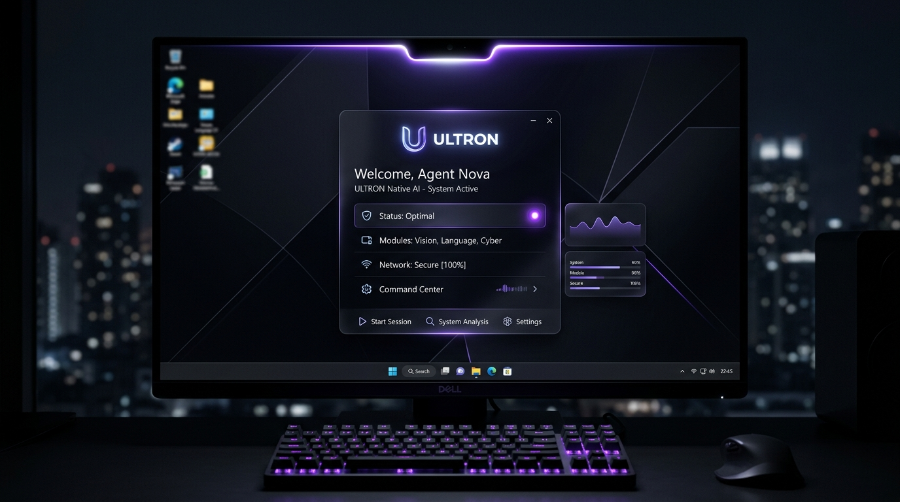
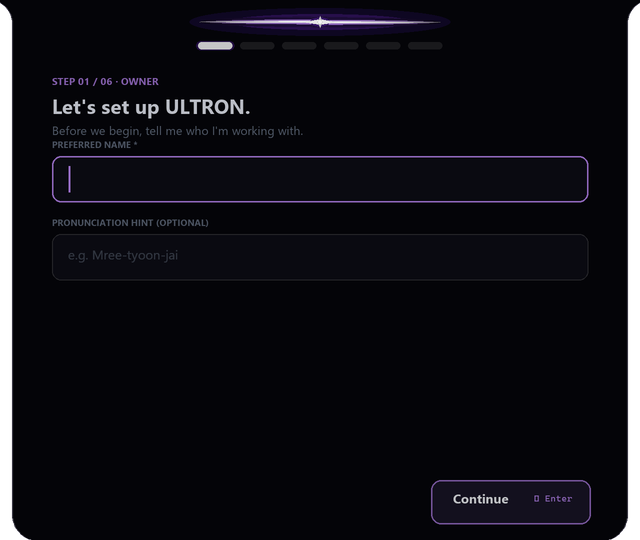
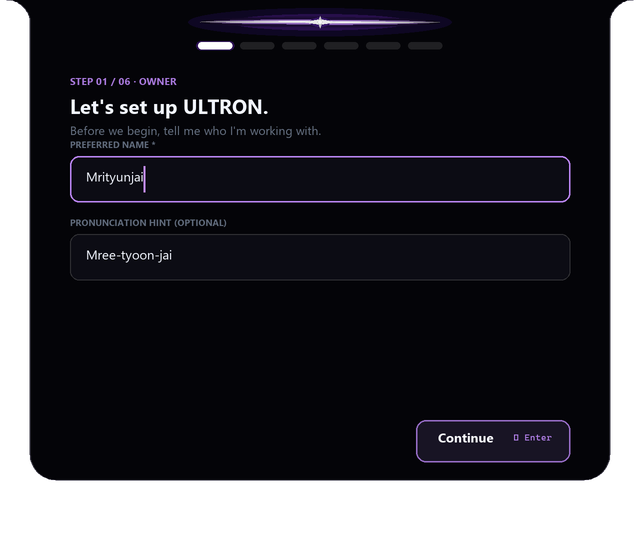
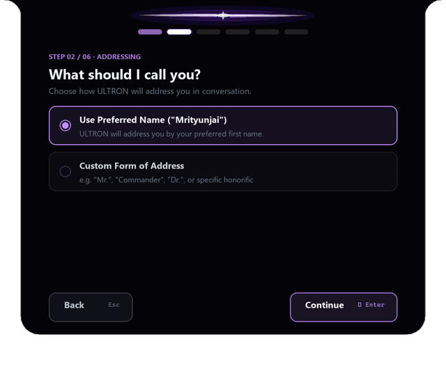
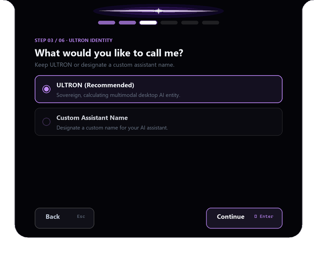
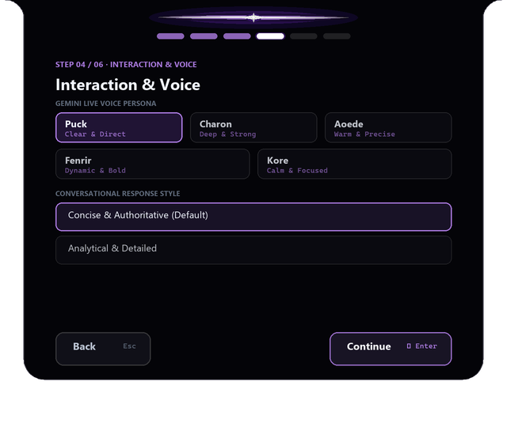
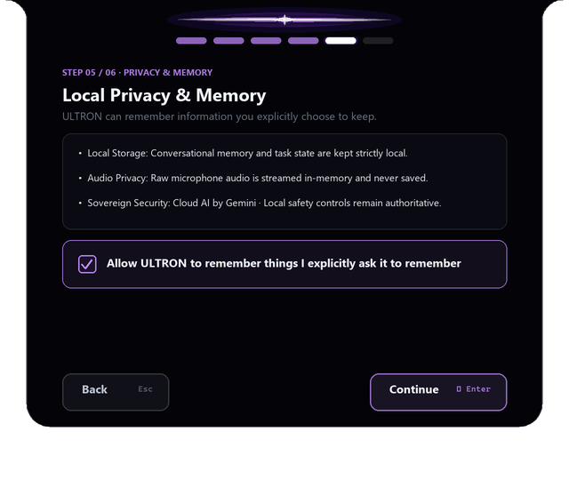
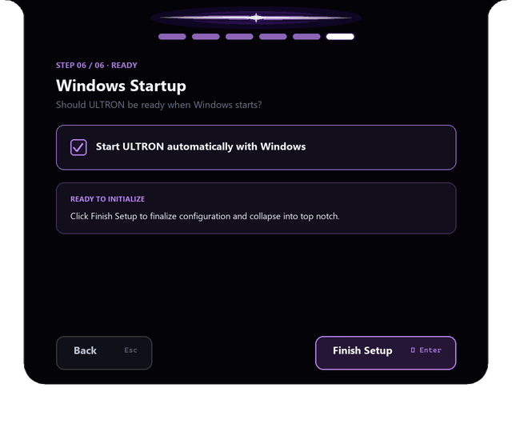
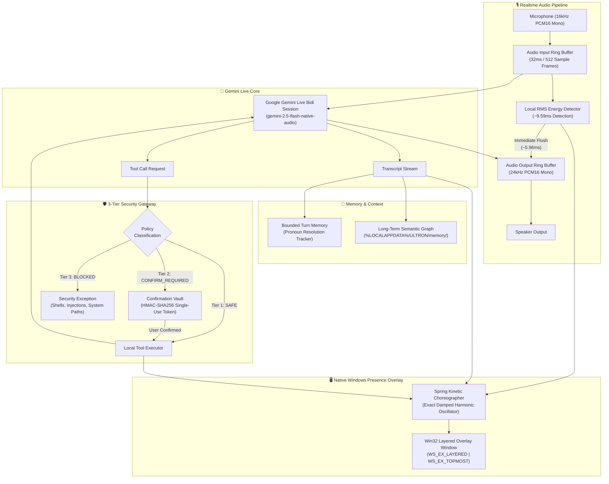

<div align="center">

# ULTRON
### Sovereign Realtime Voice AI Desktop Agent for Windows

[](https://microsoft.com/windows)
[-0052CC?logo=github&logoColor=white)](https://github.com/Mrityunjai-hue/ultron/releases/latest)
[-success?logo=windows&logoColor=white)](https://github.com/Mrityunjai-hue/ultron/releases/download/v0.1.0/Ultron-v0.1.0-windows-x64.zip)
[](https://python.org)
[](https://ai.google.dev)
[](#safety-model)
[](LICENSE)

<br/>

### ⬇️ **[Download ULTRON v0.1.0 for Windows (Portable .ZIP)](https://github.com/Mrityunjai-hue/ultron/releases/download/v0.1.0/Ultron-v0.1.0-windows-x64.zip)**
**[📦 All Release Assets & Checksums](https://github.com/Mrityunjai-hue/ultron/releases/latest)** &nbsp;•&nbsp; **[📄 SHA256SUMS](https://github.com/Mrityunjai-hue/ultron/releases/download/v0.1.0/SHA256SUMS.txt)** &nbsp;•&nbsp; **[🛡️ SBOM (CycloneDX)](https://github.com/Mrityunjai-hue/ultron/releases/download/v0.1.0/sbom.json)**

*Zero dependencies required • Extract and launch `ultron.exe` • No Python, Git, or compiler needed*

<br/>



<br/><br/>

| ⚡ Gemini Live | 🎙️ Realtime Voice | 💻 Local Tools | 🛡️ Safety First |
| :---: | :---: | :---: | :---: |
| Native Bidirectional WebSockets via `gemini-2.5-flash-native-audio` | ~15.5ms Local Barge-In Interruption & 32ms Audio Frame Streaming | Direct Win32 Desktop Control & CDP Browser Automation | 3-Tier Security Gateway & Single-Use Cryptographic Auth Tokens |

</div>

<br/>

---

## 📖 Table of Contents

- [What is ULTRON?](#-what-is-ultron)
- [Product Gallery](#-product-gallery)
- [Architecture](#-architecture)
- [Installation](#-installation)
- [Quick Start](#-quick-start)
- [Configuration](#-configuration)
- [How It Works](#-how-it-works)
  - [1. Realtime Audio Loop](#1-realtime-audio-loop)
  - [2. Sub-50ms Barge-In Interruption](#2-sub-50ms-barge-in-interruption)
  - [3. The Singularity Crease Presence UI](#3-the-singularity-crease-presence-ui)
- [Safety Model](#-safety-model)
- [Tasks & Browser Automation](#-tasks--browser-automation)
- [Development](#-development)
- [Release Engineering](#-release-engineering)
- [Security & Privacy](#-security--privacy)
- [Contributing](#-contributing)

---

## 🌌 What is ULTRON?

**ULTRON** is not a web app in a browser tab or an Electron wrapper. It is a **sovereign, native Windows desktop AI agent** engineered from the ground up for instantaneous voice communication, autonomous multi-step desktop task planning, and zero-compromise security.

Living as an obsidian liquid glass dynamic presence anchored to your screen bezel, ULTRON provides:

- **True Bidirectional Conversational Streaming**: Speak naturally and interrupt at any millisecond with **~15.5ms local barge-in response** without turn delays or latency lags.
- **Autonomous Multi-Step Task Execution**: Decomposes complex human intents (*"Open Chrome, navigate to GitHub, extract issues, and summarize to a file"*) into verified, dependency-resolved task graphs.
- **Pure Native Win32 Performance**: Consumes **<0.2% CPU** at idle and **~85 MB RAM** in standalone Windows x64 execution using Win32 layered windows (`WS_EX_LAYERED`) and GDI+ rendering.
- **Zero-Trust Security Boundary**: 3-tier execution policy (`SAFE`, `CONFIRM_REQUIRED`, `BLOCKED`) where destructive file operations require single-use HMAC-SHA256 confirmation tokens. Shell access (`cmd`, `powershell`, `bash`) is permanently blocked.

---

## 🖼️ Product Gallery

ULTRON features the **Liquid Onboarding Experience**: a seamless transformation where the compact top-bezel notch physically deforms and expands downward into an obsidian configuration surface, guides the user through setup, and collapses back into the resting notch.

<div align="center">

| 1. Resting Top Notch | 2. Liquid Downward Expansion |
| :---: | :---: |
|  |  |

| 3. Step 01: Owner Identity | 4. Step 02: Conversational Addressing |
| :---: | :---: |
|  |  |

| 5. Step 03: Assistant Identity | 6. Step 04: Voice & Response Style |
| :---: | :---: |
|  |  |

| 7. Step 05: Privacy & Local Memory | 8. Step 06: Startup & Finish |
| :---: | :---: |
|  |  |

| 9. Liquid Collapse Sequence | 10. Restored Resting Notch |
| :---: | :---: |
|  |  |

</div>

---

## 🏛️ Architecture



*For comprehensive subsystem specifications and event flows, see [docs/ARCHITECTURE.md](docs/ARCHITECTURE.md).*

---

## 📦 Installation

### Option A: Standalone Windows Binary (Recommended)

| Release Asset | Format | Direct Download Link | Purpose |
| :--- | :---: | :--- | :--- |
| **Ultron Portable ZIP** | `.zip` | [**Ultron-v0.1.0-windows-x64.zip**](https://github.com/Mrityunjai-hue/ultron/releases/download/v0.1.0/Ultron-v0.1.0-windows-x64.zip) | Standalone Windows x64 binary. Extract & run `ultron.exe`. |
| **Ultron Setup Installer** | `.py` | [**Ultron-Setup-0.1.0.py**](https://github.com/Mrityunjai-hue/ultron/releases/download/v0.1.0/Ultron-Setup-0.1.0.py) | Self-contained automated Windows installer package. |
| **Checksum Manifest** | `.txt` | [**SHA256SUMS.txt**](https://github.com/Mrityunjai-hue/ultron/releases/download/v0.1.0/SHA256SUMS.txt) | Official SHA256 verification digests. |
| **Software Bill of Materials** | `.json` | [**sbom.json**](https://github.com/Mrityunjai-hue/ultron/releases/download/v0.1.0/sbom.json) | CycloneDX 1.4 supply chain SBOM. |

> **Zero Dependencies**: The standalone Windows distribution does **not** require Python, Git, C++ build tools, or runtime dependencies. Simply extract the ZIP archive and run `ultron.exe`.

### Option B: Build & Run from Source (Contributors)
```powershell
# 1. Clone repository
git clone https://github.com/Mrityunjai-hue/ultron.git
cd ultron

# 2. Create isolated virtual environment
python -m venv .venv
.venv\Scripts\Activate.ps1

# 3. Install dependencies
pip install -r requirements.txt
pip install -r requirements-build.txt
```

---

## 🚀 Quick Start

### 1. Store Your Gemini API Key
ULTRON stores credentials locally using hardware-bound **Windows DPAPI** encryption:
```powershell
# Store API Key securely in Windows DPAPI vault (Never stored in plaintext)
python -m ultron.main --set-api-key "AIzaSyYourApiKeyHere"
```
*(Alternatively, create a local `.env` file containing `GEMINI_API_KEY="AIzaSy..."` for development).*

### 2. Launch ULTRON
```powershell
# Launch full cinematic experience with dynamic desktop presence
python run.py

# Launch in voice-only CLI mode (No overlay window)
python -m ultron.main --no-ui

# Run system health check
python -m ultron.main --health

# Run machine-readable diagnostics
python -m ultron.main --diagnostics

# Run performance & latency benchmark
python -m ultron.main --benchmark
```

---

## ⚙️ Configuration

User preferences are persisted atomically to `%LOCALAPPDATA%\ULTRON\config\user_config.json`, completely isolated from application binaries:

```json
{
  "owner_name": "<REDACTED>",
  "pronunciation_hint": "<REDACTED>",
  "addressing_name": "<REDACTED>",
  "assistant_name": "ULTRON",
  "preferred_language": "English (US)",
  "voice_preference": "Puck",
  "response_style": "Concise & Authoritative",
  "presence_enabled": true,
  "allow_explicit_memory": true,
  "start_with_windows": false,
  "first_run_completed": true
}
```

### Physical Storage Boundaries
| Category | File Path | Security Guarantee |
| :--- | :--- | :--- |
| **Application Binaries** | `C:\Program Files\ULTRON\` | Read-only application code |
| **User Configuration** | `%LOCALAPPDATA%\ULTRON\config\user_config.json` | Atomic swap write, corruption self-healing |
| **Encrypted Credentials** | `%LOCALAPPDATA%\ULTRON\config\credentials.dpapi` | User-bound Windows DPAPI encryption |
| **Task Checkpoints & Logs** | `%LOCALAPPDATA%\ULTRON\tasks\` | Append-only execution journal & evidence chains |
| **Semantic Memory** | `%LOCALAPPDATA%\ULTRON\memory\` | Bounded facts store with active regex secret scrub |
| **Sanitized Logs** | `%LOCALAPPDATA%\ULTRON\logs\` | 10MB rotating logs with real-time secret redaction |
| **Runtime Cache** | `%LOCALAPPDATA%\ULTRON\cache\` | Temporary cache & CDP browser session profiles |

*For storage schemas and security boundaries, see [docs/CONFIGURATION.md](docs/CONFIGURATION.md).*

---

## 🔬 How It Works

### 1. Realtime Audio Loop
- **Input Stream**: Captures microphone audio at `16,000 Hz` (16-bit PCM Mono) in `32ms` frames (512 samples) and streams directly to Gemini Live WebSockets with zero disk buffering.
- **Output Stream**: Receives synthesized speech at `24,000 Hz` (16-bit PCM Mono) and feeds an adaptive ring buffer with continuous underflow protection.

### 2. Sub-50ms Barge-In Interruption
When you speak while ULTRON is responding, a dual-tier interruption triggers:
1. **Local RMS Energy Detector**: Senses voice onset in **~9.59ms** and flushes local hardware audio playback in **~5.96ms** (~15.55ms total local latency).
2. **Server-Side Interruption Signal**: Sends client cancellation to the Gemini Live session, halting cloud audio generation without turn delay.

### 3. The Singularity Crease Presence UI
The top-bezel overlay window uses **underdamped harmonic oscillator spring physics**:
$$\ddot{x} + 2\zeta\omega_0 \dot{x} + \omega_0^2 (x - x_{\text{target}}) = 0$$
- **Obsidian Dark Material**: Solid capsule attaching seamlessly to the top screen bezel.
- **Parametric Laser Crease**: Incandescent core that breathes during listening, pulses while thinking, and undulates with voice amplitude during speaking.
- **Non-Rectangular Click-Through**: Transparent areas pass mouse clicks to background applications via `WM_NCHITTEST` (`HTTRANSPARENT`), capturing input only on opaque controls (`HTCLIENT`).

---

## 🛡️ Safety Model

ULTRON operates under a **3-Tier Local Security Policy** (`SAFE`, `CONFIRM_REQUIRED`, `BLOCKED`):

| Tool Category | Tools | Safety Tier | Enforcement Mechanism |
| :--- | :--- | :--- | :--- |
| **System Telemetry** | `get_current_time`, `get_system_status` | `SAFE` | Read-only telemetry, immediate execution. |
| **App Launch** | `open_app`, `windows_open_app` | `SAFE` | Launched via safe Win32 API without shell execution. |
| **File Read** | `read_file`, `list_directory` | `SAFE` | Sandboxed to workspace; rejects OS system folders. |
| **File Modification / Delete** | `write_file`, `delete_file`, `move_file` | `CONFIRM_REQUIRED` | Single-use cryptographic token required. |
| **App Termination** | `close_app`, `windows_close_app` | `CONFIRM_REQUIRED` | Confirmation token required; critical system processes protected. |
| **File Download** | `chrome_download_file` | `CONFIRM_REQUIRED` | Sandboxed to workspace; blocks executable extensions (`.exe`, `.bat`, `.ps1`). |
| **Arbitrary Shells** | `cmd`, `powershell`, `pwsh`, `bash`, `wsl` | `BLOCKED` | Permanently rejected by static analysis. |
| **Command Injection** | `&`, `\|`, `;`, `>`, `<`, `` ` ``, `$`, `\n` | `BLOCKED` | Rejected before execution. |

### Cryptographic Confirmation Tokens
Destructive actions generate a unique token:
$$\text{Token} = \text{HMAC-SHA256}(\text{Tool} \parallel \text{Target} \parallel \text{SessionID} \parallel \text{Salt})$$
- Valid for 60 seconds (TTL expiration).
- Single-use only (burned immediately upon evaluation).
- Replay and parameter tampering immune.

*For full security disclosures, threat models, and policy invariants, see [SECURITY.md](SECURITY.md).*

---

## 🧭 Tasks & Browser Automation

ULTRON features an integrated autonomous task planning and execution engine:

- **Goal Planner**: Converts high-level natural language goals into acyclic dependency graphs (DAGs).
- **Chrome DevTools Protocol (CDP)**: Controls existing or headless browser instances to perform authentic navigation, DOM extraction, text entry, and clicking.
- **Mandatory Verification**: Every action step undergoes automated post-action evidence verification before proceeding to dependent steps.

---

## 💻 Development

### Running the Test Suite
The repository includes **265 comprehensive tests** covering core runtime, streaming, tools, tasks, browser CDP, adversarial security, onboarding, and release packaging:

```powershell
# Run full test suite
python -m pytest tests -v

# Run specific test modules
python -m pytest tests/test_phase10_adversarial.py -v     # 80 Adversarial Security Tests
python -m pytest tests/test_phase11_onboarding.py -v      # 20 Liquid Onboarding Tests
python -m pytest tests/test_phase11_release_pipeline.py -v # 9 Supply Chain Security Tests
```

### Running the Automated Secret Scanner
```powershell
python scripts/secret_scanner.py . --fail-on-findings
```

*For complete developer setup and CLI modes, see [docs/DEVELOPMENT.md](docs/DEVELOPMENT.md).*

---

## 🚢 Release Engineering

The release supply chain enforces an immutable pipeline from tagged commit to signed Windows binary:

```powershell
# 1. Compile standalone PE binary and scan artifacts
python scripts/build_windows_dist.py

# 2. Generate self-contained setup installer
python scripts/build_installer.py

# 3. Compute SHA256 checksums and release manifests
python scripts/generate_release_manifest.py

# 4. Verify clean sandbox installation E2E
python scripts/verify_clean_install_e2e.py
```

### GitHub Actions Release Automation
Releases are triggered exclusively via version tags (`v0.1.0`):
- 40-character commit SHA pinned actions (`actions/checkout`, `actions/setup-python`, `actions/attest-build-provenance`).
- Automatic generation of CycloneDX 1.4 SBOM (`sbom.json`) and SHA256 digests (`SHA256SUMS.txt`).
- GitHub Artifact Build Provenance Attestation.

*For release pipeline architecture and gate definitions, see [docs/RELEASE.md](docs/RELEASE.md).*

---

## 🔒 Security & Privacy

1. **Local-Only User Data**: Your name, conversational preferences, memories, task history, and encryption keys never leave your machine.
2. **Zero Plaintext Credentials**: API keys are encrypted with Windows DPAPI.
3. **Redacted Diagnostics**: All system diagnostics, health checks, and logs omit personal identifiers and secret values.
4. **No Raw Audio Storage**: Microphone input and speaker playback are processed strictly in volatile memory.

---

## 🤝 Contributing

Contributions are welcome! Please ensure that:
1. All changes maintain **100% pass rate** on the 265-test suite (`python -m pytest`).
2. The automated secret scanner passes with **0 findings** (`python scripts/secret_scanner.py .`).
3. Security invariants (3-tier safety gateway, confirmation tokens, shell blocking) are strictly preserved.

*For pull request guidelines and commit standards, see [CONTRIBUTING.md](CONTRIBUTING.md).*

---

<div align="center">

**ULTRON — Sovereign Windows AI Desktop Agent**  
*Engineered for speed, built for autonomy, designed for privacy.*

</div>
