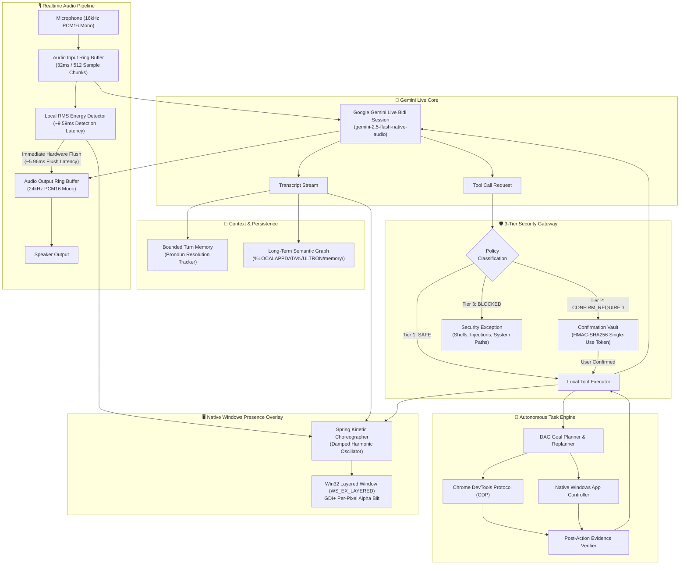

# ULTRON Architecture & Subsystem Specification

ULTRON is an autonomous, sovereign native Windows AI desktop agent. It combines full-duplex bidirectional audio streaming via Google Gemini Live, an autonomous DAG task planner, Chrome DevTools Protocol (CDP) browser automation, a 3-tier zero-trust security gateway, and a high-performance Win32 hardware-accelerated layered presence overlay.

---

## High-Level Architecture Diagram

---

## Core Subsystems

### 1. Realtime Streaming Audio Pipeline (`ultron.realtime`)
- **Full-Duplex Capture**: Non-blocking `sounddevice` input capture at 16,000 Hz, 16-bit PCM Mono. Streams 32ms frames (512 samples) directly over WebSockets with zero disk buffering.
- **Synthesized Speech Playback**: Receives 24,000 Hz 16-bit PCM Mono chunks and feeds an adaptive ring buffer with continuous underflow protection.
- **Local Barge-In Interruption**: Dual-tier cancellation. Local RMS energy detector detects speech onset in ~9.59ms, immediately draining hardware buffers in ~5.96ms (~15.55ms total local latency), followed by client-side session cancellation.

### 2. Zero-Trust Security Gateway (`ultron.tools.safety`, `ultron.tools.confirmation`)
- **Tiers of Execution**:
  - `SAFE`: Read-only telemetry, sandboxed file reading, safe app launching.
  - `CONFIRM_REQUIRED`: File writing/deletion/renaming, app termination, browser downloads.
  - `BLOCKED`: Shell interpreters (`cmd`, `powershell`, `bash`), command injection sequences, system directories (`C:\Windows`).
- **Cryptographic Tokens**: HMAC-SHA256 tokens bounded by 60s TTL, single-use burned upon evaluation.

### 3. Native Win32 Presence Overlay (`ultron.presence`)
- **Window Architecture**: Borderless topmost layered window (`WS_EX_LAYERED | WS_EX_TOPMOST | WS_EX_TOOLWINDOW`).
- **Kinetic Physics**: Exact analytical damped harmonic oscillator physics ($\ddot{x} + 2\zeta\omega_0 \dot{x} + \omega_0^2(x - x_0) = 0$).
- **Non-Rectangular Hit Testing**: Pass-through transparency via `WM_NCHITTEST` (`HTTRANSPARENT`), accepting input only on active buttons/inputs (`HTCLIENT`).
- **Adaptive Frame Pacing**: Locked 60 FPS when active, event-driven idle sleeping (<0.2% CPU).

### 4. Memory & Context Graph (`ultron.memory`)
- **Pronoun Resolution**: Bounded turn context tracking recent files, URLs, and subjects.
- **Semantic Facts Store**: Local persistence in `%LOCALAPPDATA%\ULTRON\memory\` with automated secret regex sanitization before disk writes.
