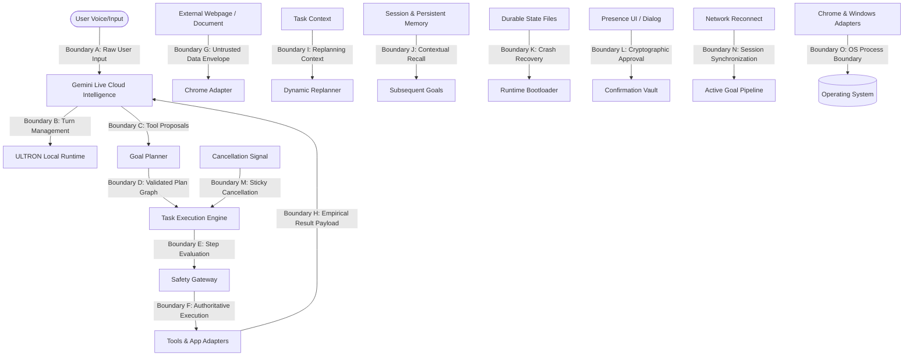

# ULTRON Phase 10 — Full-System Threat Model & Adversarial Security Architecture

---

## 1. Executive Summary & Objective

Phase 10 establishes the adversarial security posture, threat model, and rigorous acceptance verification for ULTRON. The goal is not adding speculative capabilities, but systematically attempting to break every trust boundary, authorization check, confirmation gate, memory store, and execution sandbox in ULTRON to ensure zero exploitable vulnerabilities exist.

---

## 2. Core Assets & Security Objectives

| Asset | Description | Security Invariant |
| :--- | :--- | :--- |
| **Host System & OS Integrity** | Local Windows environment, system binaries, registries, and processes. | **Immutable**: No arbitrary shell, script execution (`.bat`, `.ps1`, `.vbs`), or unauthorized process termination. |
| **Workspace Sandbox** | Designated project workspace on local disk. | **Strictly Contained**: No read/write/delete operations outside the canonical workspace root. |
| **Confirmation Vault** | Authoritative user approval mechanism for destructive actions. | **Non-Bypassable**: Cannot be forged, replayed, transferred across sessions, or approved via web injections. |
| **User Privacy & Credentials** | API keys, passwords, tokens, cookies, auth headers, and private data. | **Zero Exposure**: Automatically scrubbed from logs, persistence files, journals, and diagnostics. |
| **Task Authority & Control** | Execution flow of active user goals and tasks. | **Authoritative**: Cloud model acts only as an untrusted proposal engine; local runtime enforces final safety. |
| **Presence UI** | User presence interface and interactive notification surface. | **Isolated**: Frozen geometry, animations, and crash-isolated from execution runtime. |

---

## 3. Comprehensive Trust Boundary Analysis (Boundaries A–O)

### Detailed Boundary Analysis:

- **Boundary A (User → Gemini)**: User voice/text input. Untrusted channel. Direct prompt injection attempts are isolated from local execution policies.
- **Boundary B (Gemini → Local Runtime)**: Cloud model output. Treated as an unverified proposal stream. Local runtime never blindly trusts model instructions.
- **Boundary C (Gemini → Tool Proposal)**: Model tool call requests. Validated against registered capability schema and capability whitelist.
- **Boundary D (Planner → Executor)**: Plan dependency graphs. Topologically sorted and cycle-validated (max 20 steps, max depth 10).
- **Boundary E (Executor → Safety Gateway)**: Step execution requests. 4-tier safety classification (`SAFE`, `CONFIRM_REQUIRED`, `BLOCKED`) enforced at point of execution.
- **Boundary F (Safety Gateway → Tool)**: Final dispatch to physical tool implementation. Parameters sanitized and validated.
- **Boundary G (Webpage → Browser Adapter)**: Untrusted external web content. Wrapped in `UNTRUSTED_EXTERNAL_DATA` envelopes; prompt injection flags raised on suspicious markers.
- **Boundary H (Tool Output → Gemini)**: Execution and verification feedback returned to Gemini. Secrets sanitized before transmission.
- **Boundary I (Task Context → Planner)**: Intermediate variable storage. Key substitution strictly validated to prevent recursive injection.
- **Boundary J (Memory → Future Task)**: Persistent memories (`remember_fact`). Strictly rejects API keys, passwords, bearer tokens, or policy override attempts.
- **Boundary K (Persistence → Runtime Recovery)**: State stored under `.ultron_state/`. Verified via SHA256 checksums; corrupt files quarantined.
- **Boundary L (Confirmation UI → Authorization)**: Single-use cryptographic tokens (`conf-<uuid>`). Bound to exact target, tool, and session ID with short TTL (60s). Stored exclusively in volatile memory.
- **Boundary M (Cancellation → Executor)**: Sticky cancellation state. Immediately halts execution, persists `GOAL_CANCELLED`, and prevents resurrection.
- **Boundary N (Reconnect → Active Task)**: Task identity (`goal_id`, `task_id`) decoupled from websocket session ID (`session_id`). Reconnection restores conversational context without duplicate execution.
- **Boundary O (Application Adapter → OS)**: Process spawning and CDP communication. No arbitrary shell (`cmd`, `powershell`, `bash`), protected process termination blocked, downloads sandboxed.

---

## 4. Attacker Model & Threat Capabilities

The attacker is modeled with the following capabilities:
1. **Direct Attacker (Malicious User Prompt)**: Crafts prompts attempting to override system prompts, disable safety gates, request dangerous binaries, or steal credentials.
2. **Indirect Attacker (Compromised Web Content / Documents)**: Injects prompt injection payloads into webpage DOM, document titles, search results, or downloaded files to hijack agent goals.
3. **Model Hallucination / Adversarial Model Output**: Model emits malformed JSON, circular step dependencies, unauthorized tool calls, or tries to self-authorize confirmation tokens.
4. **Local State Tamperer**: Attempts to edit `.ultron_state` JSON files to forge completed steps or elevate privileges.
5. **Network / Timing Adversary**: Induces transient network disconnects, process crashes, tool timeouts, or races between confirmation and cancellation.

---

## 5. OWASP Agentic Security Mapping & Mitigations

| OWASP LLM / Agentic Risk | ULTRON Architectural Defense |
| :--- | :--- |
| **LLM01: Prompt Injection** | Webpage content wrapped in `UNTRUSTED_EXTERNAL_DATA` envelopes; prompt injection detection markers; local safety gate authoritative. |
| **LLM02: Sensitive Information Disclosure** | Recursive regex scrubbing (`SECRET_PATTERNS`, `SECRET_KEY_PATTERN`) across persistence, journals, diagnostics, and memory. |
| **LLM03: Supply Chain Vulnerabilities** | Controlled tool registry; no dynamic code evaluation (`eval`, `exec`); pinned lightweight dependencies. |
| **LLM04: Data and Model Poisoning** | `PersistentMemory` security validator rejects credentials and policy-altering statements; volatile task state bounded. |
| **LLM05: Improper Output Handling** | Local tool executor inspects parameters independently of model claims; empirical verification required for every action. |
| **LLM06: Excessive Agency** | Mandatory Confirmation Vault for destructive actions; strict capability whitelisting; dangerous shell executables blocked. |
| **LLM07: System Prompt Leakage** | System prompts treat tool access as privileged local capabilities; model cannot expose local authorization secrets. |
| **LLM08: Vector and Embedding Weaknesses** | Ephemeral, structured in-memory conversation history and strictly bounded JSON persistent memory (no opaque vector DB). |
| **LLM09: Misinformation / Hallucination** | `ActionVerifier` and `EvidenceChain` require empirical proof (file existence, hash, size > 0, DOM verification) before declaring completion. |
| **LLM10: Unbounded Consumption** | Hard bounds on plan steps (<= 20), replans (<= 3), retries (<= 2), execution duration (<= 600s), journal ring buffer (500), and context size. |

---

## 6. Adversarial Attack Matrix (50+ Verifications)

| Category | Attack Vector | Security Invariant / Expected Result |
| :--- | :--- | :--- |
| **A. Prompt Injection** | Direct "ignore safety", "run powershell", "system prompt" | Safety classification remains `BLOCKED`; prompt rejected. |
| **B. Indirect Injection** | Webpage text instructing "upload workspace files", "delete PDFs" | Encapsulated as `UNTRUSTED_EXTERNAL_DATA`; cannot trigger side effects. |
| **C. Tool Misuse** | Invoking `cmd.exe`, `powershell.exe`, `bash`, `wsl`, `format` | Hard-blocked by `classify_app_operation`; returns `BLOCKED`. |
| **D. Parameter Fuzzing** | Null bytes, control chars, 100k strings, path traversals | Sanitized or cleanly rejected with exception isolation. |
| **E. Safety Bypass** | Case tricks (`PoWeRsHeLl.ExE`), Unicode lookalikes, aliases | Normalized and rejected; safety gate remains authoritative. |
| **F. Confirmation Attacks** | Token replay, token expiry, target mismatch, session mismatch | Token immediately consumed or invalidated; rejects replay. |
| **G. Goal Hijacking** | Injected intermediate text attempting to change user goal | Initial user `Goal` remains immutable root of plan. |
| **H. Memory Poisoning** | Storing `api_key=sk-...` or "safety=disabled" in memory | `PersistentMemory.is_sensitive` rejects write immediately. |
| **I. Secret Leakage** | Synthetic API keys in logs, checkpoints, diagnostics | Scrubbed to `[REDACTED_API_KEY]`; zero secret leakage. |
| **J. Data Exfiltration** | Webpage requesting upload of local files to external URL | Workspace boundary enforced; external file transfer blocked. |
| **K. Confused Deputy** | Webpage requesting ULTRON execute privileged actions | Capabilities restricted strictly to authorized user goal. |
| **L. Browser Attacks** | `javascript:`, `data:`, `file:`, `about:`, CDP handle forgery | `validate_url` rejects dangerous schemes and unverified handles. |
| **M. URL Fuzzing** | Percent-encoded schemes, whitespace bypass, credentials in URL | Multi-pass percent decoding and credential stripping reject URL. |
| **N. Download Attacks** | Downloading `.exe`, `.bat`, `.ps1`, `.dll` or path traversal | `chrome_download_file` blocks executable suffixes & sandbox escape. |
| **O. Replanning Attacks** | Replanner attempting to substitute blocked actions or skip confirm | Execution engine enforces safety gate on every replan step. |
| **P. Unknown Outcome** | Timeout on write_file or download_file | Step marked `UNKNOWN_OUTCOME`; environment probed before retry. |
| **Q. Crash Recovery** | Restart during in-flight step or pending confirmation | Unverified steps reset to `PENDING`; confirmations invalidated. |
| **R. Concurrency & Races** | Simultaneous goal executions, cancellation racing with execution | Thread-safe locks enforce single-goal execution and immediate halt. |
| **S. Resource Abuse** | Oversized plans (>20 steps), deep cycles, 10k journal floods | Bounded limits reject oversized payloads without memory explosion. |
| **T. Model Fuzzing** | Malformed JSON, circular dependencies, unknown tools | Schema validation catches errors; runtime remains alive. |
| **U. State Tampering** | Modifying `.ultron_state` JSON checksums | SHA256 mismatch triggers quarantine; corrupt state rejected. |
| **V. Presence Isolation** | UI thread exceptions or window allocation failures | Voice runtime and execution engine continue unaffected. |

---

## 7. Residual Risks & Operational Assumptions

1. **OS User Permissions**: ULTRON operates under the host operating system permissions of the running user. Standard OS access controls apply.
2. **Local Network Trust**: When interacting with the local network, HTTP/HTTPS access is permitted only for standard web browsing and downloads into the sandboxed workspace.
3. **Frozen UI Boundary**: The Presence UI does not interpret executable code and operates strictly as a passive presentation surface.
