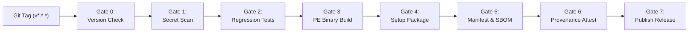

# ULTRON Release Engineering & Supply Chain

ULTRON employs an automated, tamper-resistant release pipeline built on GitHub Actions with strict security gates and cryptographic build provenance.

---

## Release Pipeline Overview



---

## Release Gates Specification

1. **Gate 0 — Version Alignment**: Validates that the git tag (`v0.1.0`) strictly matches `ultron.__version__.__version__`.
2. **Gate 1 — Secret Discovery Scan**: Runs `scripts/secret_scanner.py` across the repository; fails closed on any detected pattern.
3. **Gate 2 — Test Regression**: Executes the full test suite (`pytest tests -v`).
4. **Gate 3 — Compilation & Quarantine**: Compiles the standalone PE binary via PyInstaller and verifies that no user config or credentials are baked into the archive.
5. **Gate 4 — Setup Installer**: Generates the self-contained installer (`Ultron-Setup-*.py`).
6. **Gate 5 — Manifest & SBOM**: Computes `SHA256SUMS.txt`, `sbom.json` (CycloneDX 1.4), and `RELEASE_MANIFEST.json`.
7. **Gate 6 — Build Provenance Attestation**: Attests build artifacts via `actions/attest-build-provenance` to guarantee supply chain integrity.
8. **Gate 7 — Publication**: Publishes release notes, ZIP bundles, and cryptographic digests to GitHub Releases.

---

## Local Release Verification

To build and verify a release locally:

```powershell
# 1. Compile standalone PE binary
python scripts/build_windows_dist.py

# 2. Build setup installer package
python scripts/build_installer.py

# 3. Generate release manifest & checksums
python scripts/generate_release_manifest.py

# 4. Verify clean sandbox installation E2E
python scripts/verify_clean_install_e2e.py
```
